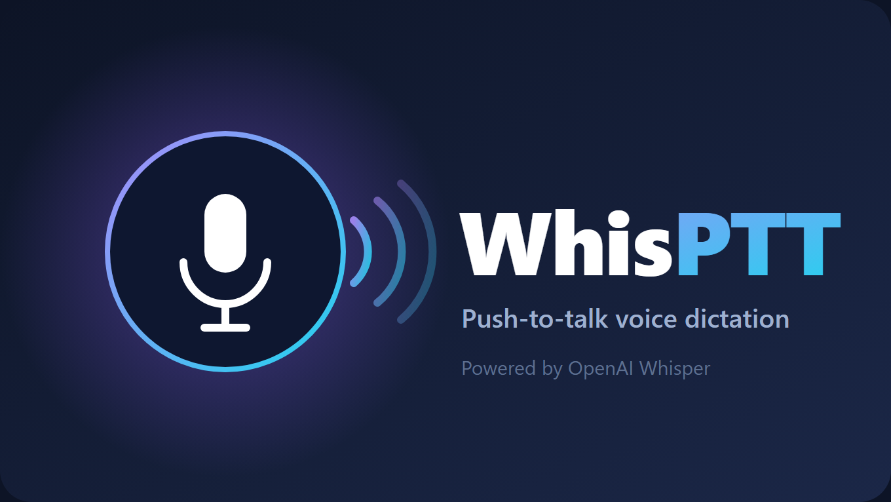

# WhisPTT

Push-to-talk voice dictation for the Steam Deck. Hold a button, speak, release —
your words are transcribed by OpenAI Whisper and typed straight into the focused
text field: game chat, search boxes, anything you can type into.

<!-- TODO: add assets/thumbnail.png and uncomment -->
<!--  -->

## Features

- **Push-to-talk dictation** — hold your trigger, speak, release; the text lands
  wherever your cursor is.
- **Input options that cover every Deck context:**
  - **Controller combo** — read straight off the gamepad, so it works **in-game**.
    Map one physical button in Steam Input to emit a chord (e.g. Select + R3).
  - **Keyboard / touchscreen** — works in the **Steam UI**: Quick Access Menu,
    Gaming Mode menus, even the on-screen keyboard.
  - **USB keyboard when docked** — just bind a normal key.
- **In-field status caption** — shows `[recording...]` while you talk, then
  replaces it with your transcription.
- **Type into the field, or copy to clipboard.**
- **Model & language choice** — defaults to `gpt-4o-mini-transcribe` (fast, cheap).

## Requirements

- [Decky Loader](https://decky.xyz) on your Steam Deck.
- An **OpenAI API key** with billing enabled (platform.openai.com). The API is
  pay-as-you-go and **separate from any ChatGPT subscription**. Transcription is
  very cheap — a fraction of a cent per dictation with `gpt-4o-mini-transcribe`.
- A network connection (audio is sent to OpenAI to transcribe).

## Setup

1. Install WhisPTT (Decky store, or manually — see [Development](#development)).
2. Open the **WhisPTT** panel in the Quick Access Menu.
3. **Save your OpenAI API key.**
4. Bind a trigger:
   - **Controller:** in the *Controller combo* section, toggle the buttons that
     form your chord. Then, in **Steam Input**, map one physical button (a back
     grip works great) to emit that exact chord as gamepad output. Pick a
     "physically impossible" combo like **Select + R3** — no game binds it, so
     it never conflicts.
   - **Keyboard / touch:** tap **PTT key** and press a key (or touch the screen).
5. Turn **Enabled** on. Hold your trigger, speak, release.

## Privacy

Audio you dictate is sent to OpenAI's transcription API over HTTPS and is
subject to [OpenAI's data policies](https://openai.com/policies). Your API key
is stored locally on the Deck, owner-readable only (`0600`), and is sent only as
the API `Authorization` header — never anywhere else.

## Limitations

- Typed output uses a **US keyboard layout** and covers printable ASCII;
  characters outside that set are skipped when typing. Switch **Output → Copy to
  clipboard** to preserve full Unicode.
- The controller combo is read **passively** from the virtual gamepad, so the
  game also receives those buttons. Pick a combo the game doesn't use (the whole
  point of the "impossible chord" trick above).

## Development

Built with the Decky toolchain (`@decky/ui`, `@decky/api`, rollup) and a
**pure-stdlib Python backend** — no native dependencies, nothing to compile for
SteamOS.

```bash
pnpm install
pnpm run build      # emits dist/index.js
```

Deploy to a Deck over SSH (Windows): `scripts/deploy.ps1 -Deck deck@<ip>`, or
copy the built plugin folder (`dist/`, `*.py`, `plugin.json`, `package.json`)
into `~/homebrew/plugins/WhisPTT/` and restart `plugin_loader`.

**Architecture:** the backend runs as root (`flags: ["root"]`) and uses the
kernel input layer directly — `evdev_listener.py` reads `/dev/input/event*` for
PTT detection (keyboard keys, and gamepad `BTN_*`/triggers off Steam's virtual
X-Box 360 pad), and `uinput_kbd.py` injects keystrokes via `/dev/uinput`. Both
are hand-rolled with `struct` + `ioctl`, so there are no third-party Python deps.
`recorder.py` captures the mic (`pw-record`/`parecord`/`arecord`) and
`transcriber.py` POSTs to OpenAI with a stdlib multipart request.
